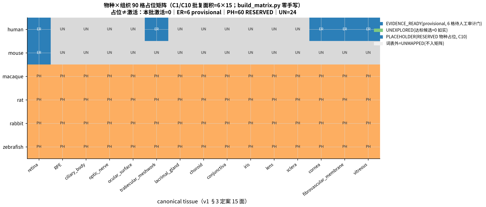
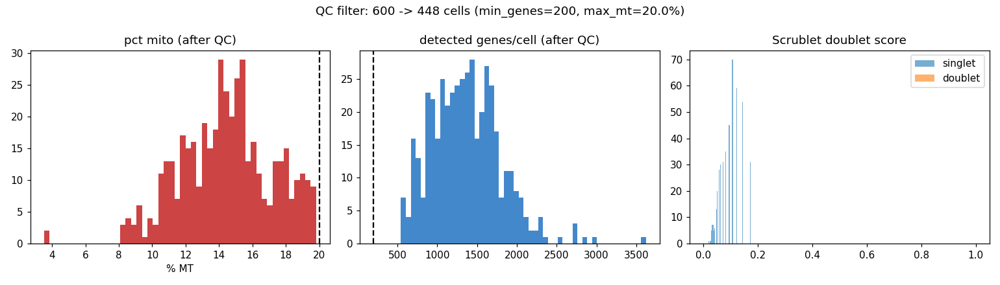
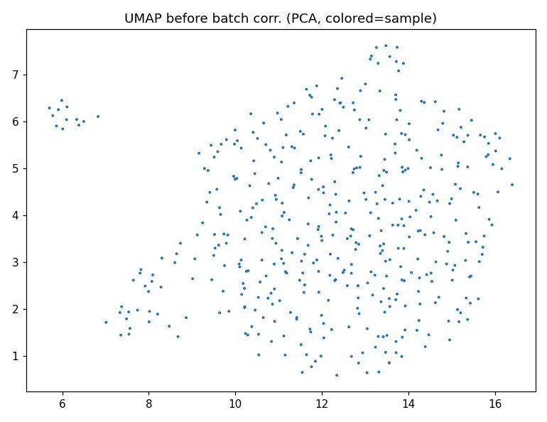
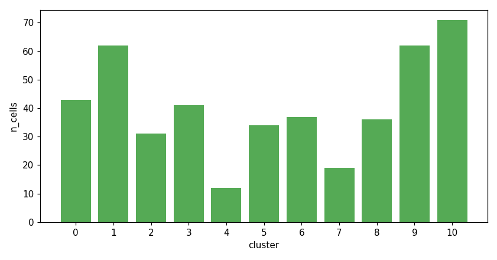
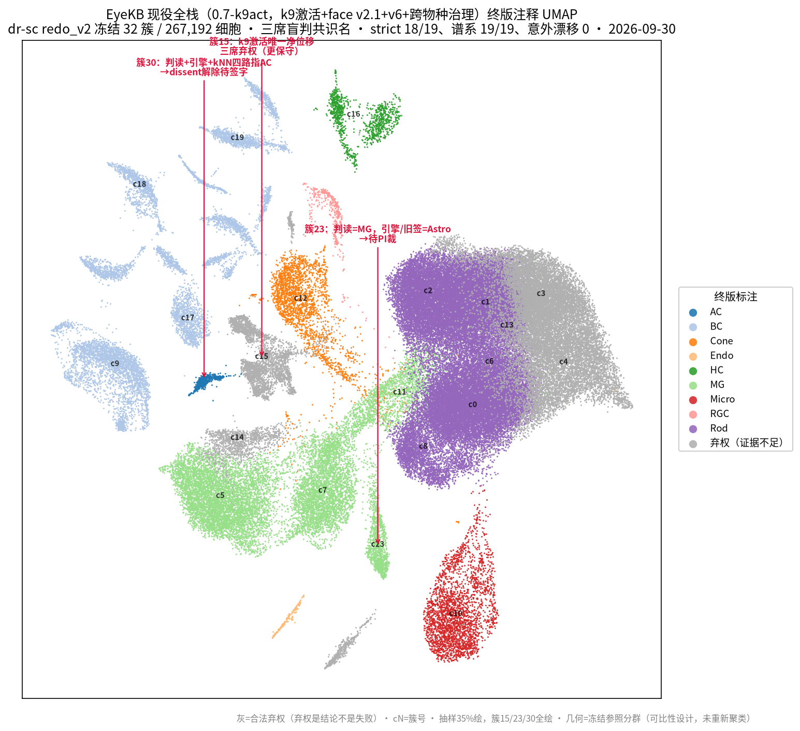

# EyeKB — an evidence-backed cell-type knowledge base and literature retrieval service for ocular single-cell annotation

**EyeKB assists cell-type annotation of single-cell RNA-sequencing (scRNA-seq) data from eye tissues.** It consists of two parts:

1. **A cell-type knowledge base** — marker-gene dictionaries, tissue composition baselines, and disease-context priors for the human eye and mouse retina; every knowledge entry carries its literature source (PMID).
2. **A local literature retrieval engine** — ~243,000 indexed chunks from 3,800+ ophthalmology publications, queryable by cell type, tissue, or gene.

When you are analyzing ocular single-cell data and face an unlabeled cell cluster, EyeKB helps answer three questions: what cell type is this cluster most likely to be, which marker genes support that call, and which publications back the evidence.

Current service version: `KB1v2-0.7-k9act`. Maintained by an ophthalmology research group for annotation quality control in our own and collaborating projects.

**Scope boundary**: this is a research assistance tool — not a clinical diagnostic device and not a black-box classifier. Every retrieval result carries a PubMed ID and can be checked one by one; all annotation conclusions are valid only after researcher confirmation (human-in-the-loop).

## Inputs and outputs

### Input

Two standard formats, either one:

- **`.h5ad`** (AnnData object, Scanpy workflow output; reading/writing with anndata ≥ 0.13 is recommended)
- **A 10X Genomics directory** (`matrix.mtx` + `barcodes.tsv` + `genes.tsv`; Ensembl IDs or gene symbols, auto-mapped)

Requirements on the input data:

1. **Raw count matrix.** Normalization, highly-variable-gene selection, dimensionality reduction, and batch correction happen inside the workflow; if the matrix has already been log1p/scaled, please state so at submission.
2. **Sample metadata must specify species (human / mouse) and tissue / anatomical origin** (retina, macula, vitreous membrane, ocular surface, lacrimal gland, etc.). The knowledge base is organized by *species × tissue* facets; the origin determines which composition baseline applies, and a mislabeled tissue invalidates the comparison.
3. **Provide sample group labels** (control / disease / treatment status). Disease-prior checks require groups to be activated.
4. **No patient identifiers or clinical privacy fields.** The system consumes expression matrices and metadata only; please remove names, MRNs, and similar fields before submission.

Pre-existing annotation results are not required; if you have an expected cell-type list, you may submit it alongside for comparison.

### Output

| Artifact | Contents |
|---|---|
| **Annotation evidence report** (one per cluster) | Marker genes of the cluster; candidate cell types with knowledge-base match scores; deviation of cluster proportions from literature baselines (donor-level intervals); disease-prior consistency checks; supporting literature passages with PMIDs; confidence level (evidence concordant / similar / conflicting or mixed — last two require manual review) |
| **Final annotation** | The `.h5ad` with labels written back after researcher confirmation |
| **QC report** | Mitochondrial fraction, detected-gene counts, doublet scores, pre/post batch correction, UMAP visualizations |
| **Audit record** | All evidence reports and human decisions archived, so each label can be traced back to the evidence at the time |

## Standard workflow

Three phases, nine steps:

**Phase A — conventional single-cell processing (standard toolchain: Scanpy / Harmony / Scrublet)**

| Step | Operation | Notes |
|---|---|---|
| 1 | Load data | Read matrices and metadata, map gene IDs to one convention, report cell/gene counts and per-sample composition |
| 2 | QC filtering | Remove low-quality droplets and dying cells (mitochondrial fraction, detected-gene thresholds); Scrublet doublet detection and removal |
| 3 | Normalize & cluster | log-normalization → highly variable genes → PCA; multi-sample data goes through Harmony batch correction first (to avoid sample-driven pseudo-clusters), then UMAP + Leiden clustering |

**Phase B — knowledge-base comparison (EyeKB core; five query tools)**

| Step | Operation | Notes | Tool |
|---|---|---|---|
| 4 | Marker matching | Look up each cluster's top genes in the marker dictionary → candidate cell types with match scores | `query_marker` |
| 5 | Composition check | Compare cluster proportions against normal-eye composition baselines (donor-level intervals faceted by tissue region and library-prep method); flag compositional outliers | `get_tissue_composition` |
| 6 | Disease-prior check | Match group labels against disease × tissue background priors; check whether observed directions agree with the literature | `get_disease_prior` |
| 7 | Literature lookup | Query the local corpus with each cluster's signature genes; return source passages, PMIDs, journal, year | `search_literature` |
| — | (Entry-level reading) | Consult full knowledge-base pages when verifying dictionary entries | `get_kb_page` |

**Phase C — researcher confirmation**

| Step | Operation | Notes |
|---|---|---|
| 8 | Cluster-by-cluster review | Concordant clusters may be confirmed in bulk; conflicting or mixed-signature clusters require individual human decisions: accept, modify, or mark *uncertain* |
| 9 | Finalize & archive | Confirmed labels are written back into the data object; evidence reports and human decisions archived together for later audit |

**Methodological discipline**: "uncertain" is a compliant output for clusters with insufficient evidence or that cannot be separated — the system never phrases a doubtful result as a definite one. Phase A is the industry-standard pipeline; Phase B is this knowledge base's contribution; final judgment in Phase C always rests with the researcher.

## Batch annotation (`pipeline/`)

Steps 1–7 of Phases A+B have a ready-to-run entry point: feed in your own data (format requirements as in **Inputs and outputs** above — raw counts, species and tissue stated, samples distinguishable) and receive per-cluster evidence reports from the five tools plus a pending-decision list.

```bash
python pipeline/run_pipeline.py --input data.h5ad --species human --tissue retina --group-col treatment --out results/run1        # h5ad input
python pipeline/run_pipeline.py --input 10x_dir/ --species human --tissue retina --sample-group "S1=control;S2=case" --out results/run2  # 10X triplet (parent dir = multi-sample)
python pipeline/run_pipeline.py --input data.h5ad --species human --tissue retina --ensg-map ids.tsv --out results/run3           # input with Ensembl IDs only
python pipeline/run_pipeline.py --input data.h5ad --out results/run4                                                                    # species/tissue omitted = auto-inference (default)
```

**Sample pre-check (S0 gate; enabled by default, shadow semantics = never blocks).** Every input first goes through automatic species × tissue determination (three evidence channels — gene-ID composition, symbol-convention × marker cross-hits, and composition scoring — plus six hard checks: species contradiction, insufficient tissue-score margin, out-of-domain, insufficient depth, suspected fetal material, etc.). On abstention the pipeline **continues** (current Phase 1 = shadow: the S0 verdict is recorded only), writing `REPORT_ABSTAIN.md` (human-readable record) and `s0_gate_report.json` (full three-channel readings). "Flag it for review instead of forcing a label" is a methodological principle; blocking enforcement is planned for a later phase behind `EYEKB_S0_ENFORCE=1`, after separate acceptance. Passing `--species/--tissue` explicitly counts as a human override and is recorded as `s0_overridden_by_user`. The environment variable `EYEKB_S0_GATE=0` is a global kill switch (restores the previous purely manual-parameter behavior for comparison and emergencies).

Once a (species × tissue) coordinate passes, the structured known-claims entries for that coordinate (`pipeline/pitfalls/`, atomic-claim contract) are injected into the evidence-report header and the pending-decision list as **risk flags** (columns `pitfall_risk_flags` / `pitfall_review_required`) — they only suggest a review direction and **never rewrite any grade, ballot, or name** (automatic relabeling is permanently 0; entry free text is not injected before independent reading, and entries with answer dependency open only after reading; see `docs/PITFALLS_RAG_ISOLATION.md`).

Five outputs per run: the processed `.h5ad` (batch-corrected, cluster-labeled), QC figures (mitochondrial fraction, gene detection, doublets, pre/post UMAP), `annotation_evidence_report.json/.md` (per-cluster top genes, marker candidates and scores, composition-baseline breach flags, disease-prior mentions, literature passages + PMIDs, mechanical confidence levels), `decisions_template.csv` (one row per cluster; the `decision` column left empty for the researcher to fill with accept / modify / **abstain** — **abstention is a legal output; this entry point never writes a definite label over a doubtful result and contains no automatic scoring or naming logic**), and `s0_gate_report.json` (S0 three-channel readings and audit trail; not produced when the gate is switched off). The default path is **zero-LLM**: the five tools are local deterministic retrieval; the optional `--llm-assist` only calls a user-provided channel (read from environment variables; the repository ships no real keys/URLs) and merely appends a reference narrative without changing grades. See `pipeline/README.md` for details.

The batch entry pins linear-algebra backends to single-threaded by default (`OMP_NUM_THREADS` and four related thread variables set via `setdefault` to 1; explicit user settings still override). Without the pin, repeated runs on the same input drift with BLAS multithreading numerics; with it, runs are byte-identical. **For byte-level reproduction keep the default pin and do not change the thread values.**

## Known-issues layer for annotation review

Beyond naming cells, this repository provides **review leads with citations for external annotations** (positioning note: this is a review-hint generator, not a label judge — flag sensitivity/false-positive rates are still under validation; see the validation status at the end of this section). Single-cell annotation lacks a public, per-item citation-backed catalog of "known failure modes" (none found in 2026-10 searches of comparable structured resources). We structured the lessons accumulated in our own multi-round blinded reviews and opened them for use with external data:

- **59 atomic entries**: each = one failure mode + observable signature + risk level + mitigation + literature/file pointer (checkable item by item), organized under a four-level coordinate scheme (cell compartment / species / tissue / condition pattern), regenerable as a whole from a single-source script (`pipeline/pitfalls/`, with `MANIFEST.sha256` verification);
- **A 90-cell coordinate matrix** (6 species × 15 tissue facets): per coordinate, the evidence state of known issues is registered honestly — evidenced / placeholder / unexplored — never covered up with neighboring knowledge (`pipeline/pitfalls/matrix/`);
- **Check against your annotations**: write the labels of your current clusters as a CSV (`cluster_id`, `label`, optional `species`/`tissue` columns) and run
  `python pipeline/pitfalls/audit_annotations.py --in your_annotations.csv --out review_results/`
  to obtain per-cluster review flags and the evidence state of each coordinate. **Output only suggests review directions; it never rewrites, downgrades, renames any existing label and constitutes no judgment of label correctness**;
- **Evidence discipline**: entry provenance and verification status are registered item by item (citation verified / human review passed). The current first batch is at "citations verified, human review in progress"; treat flags as leads — this status is surfaced honestly in tool output, not inflated.

### Mechanism details (entries / flags / five-state ladder)

The dictionaries and baselines answer "what does this cluster resemble"; the known-issues layer answers a different question — **what mistakes is this kind of sample prone to during interpretation**. It is a curated catalog of annotation pitfalls organized by *species × tissue × sample-prep condition*, distributed with the repository and fully offline.

**How entries are organized.** Each pitfall is split into **atomic claims**: one entry covers exactly one failure mode at one coordinate, with a provenance pointer (a file-level pointer to an internal observation, or a PubMed ID) and an evidence tier — `internal_observation` (our own empirical observation) / `peer_reviewed_literature` / `community_lead` (community lead: may produce review hints only, never a hard conclusion). Coordinates are governed by a controlled vocabulary: `pipeline/pitfalls/COORDINATE_TAXONOMY_v1.md` (status RATIFIED v1, finalized 2026-09-30; six species slots — human/mouse evidenced, macaque/rat/rabbit/zebrafish reserved — and fifteen canonical tissue facets). Entries that do not map into the vocabulary are registered only, never injected. **Current in-register count: 59** — 36 assigned to single (species × tissue) cells (6 single-cell pages), 1 to a species page, 22 to cross-coordinate pattern pages (21 pages, one of which carries two entries); a further 9 lead-level records are registered as non-claims (missing a failure mode or a quantitative dimension — must not be treated as claims).

**How it works (shadow semantics — flags only, verdicts untouched).** After the S0 sample pre-gate of the batch entry determines the species × tissue coordinate (see *Batch annotation* above), the applicable claims from the cell page, the species page, the tissue page, and pattern pages are pulled and injected into two places: the caution table in the evidence-report header, and the two columns `pitfall_risk_flags` (flags shaped like `REVIEW:KC-B1-014(high)`, semicolon-separated) and `pitfall_review_required` (yes/no) of the pending-decision list. Flags **only suggest review directions; no automatic re-grading, downgrading, or renaming ever executes** — the machine-readable per-run audit file `shadow_flags.jsonl` records automatic naming/grading changes as permanently 0, which is both a monitored metric and a red line. Entry free text (failure-mode descriptions and mitigations) does not enter the pre-reading surface and opens on the human side only after independent reading; the same applies to entries whose conclusions depend on specific samples/datasets (`answer_dependency` ≠ none). This is a design discipline, not a defect: pitfall text seen before independent reading would prime the researcher and compromise evidence independence. Known-issues text is never merged into the RAG literature corpus — the two sides are physically isolated (`docs/PITFALLS_RAG_ISOLATION.md`).

**How the matrix grows.** Each coordinate cell advances along a five-state ladder: `UNMAPPED` (outside the vocabulary, registered only) → `PLACEHOLDER` (reserved species / undefined facet, no knowledge) → `LEAD_ONLY` (leads exist, no locatable citation) → `EVIDENCE_READY` (≥ 3 distinct failure modes with mechanically verified provenance) → `WORKFLOW_READY` (human audit completed). Promotion requires the human audit gate; scripts never promote on their own. **Coverage, stated honestly**: all 90 cells (6×15) are placeholder-registered — **6 built** (human × {retina, trabecular_meshwork, cornea, fibrovascular_membrane, vitreous} and mouse × retina, all provisional EVIDENCE_READY, not yet through the human audit gate), **24 unexplored** (remaining tissue facets for human/mouse, UNEXPLORED), **60 placeholders** (four reserved species × 15 facets, PLACEHOLDER); **activated cells = 0** — a placeholder is not an activation, and this layer activates nothing along with the vocabulary ratification. The three-state distribution:



Maintenance entry: `pipeline/pitfalls/README.md` (entry contract, generators `build_claims.py` / `build_matrix.py`, and the `--check` verification gate; `pages/` and `matrix/` are generated products — all edits go through the scripts and regenerate).

Offline query of known-issue entries for one (species × tissue) coordinate — reads only the structured entries shipped in this repository; no literature corpus and no model needed:

```python
import sys; sys.path.insert(0, "pipeline/pitfalls")
import consume
claims, dangling = consume.pull_claims("mouse", "retina")
print(f"mouse x retina: {len(claims)} applicable claims, {len(dangling)} dangling pointers")
for c in claims[:3]:
    print(f"- {c['claim_id']} risk={c['risk_level']}")
# Example output (mouse × retina, first 3 shown):
# mouse x retina: 26 applicable claims, 0 dangling pointers
# - KC-B1-003 risk=high
# - KC-B1-004 risk=medium
# - KC-B1-007 risk=high
```

**Validation status (registered as-is, 2026-10-01)**: the comparison capability is currently a **citation-linked flag generator**. Its sensitivity to real annotation errors and its false-positive rate on correct labels have not been validated on external data under blinding — the validation protocol is frozen and approved (build the reference by blinded review first; natural positive/negative samples; compare against a no-catalog workflow; pre-registered metrics and thresholds). Until completed, this section does not claim to "evaluate annotation quality". The item-by-item human review of literature support for all 59 entries runs in parallel as a precondition.

## Knowledge architecture

| Layer | Location | Role |
|---|---|---|
| **Dictionary layer** | `kb/` (markers / composition / priors) | Reference standards for steps 4–6. Every assertion carries a PMID; managed by species, tissue, and developmental stage (fetal/adult kept separate) |
| **Literature layer** | `literature_db/` (via Releases) | The retrieval target of step 7; also the provenance of dictionary entries — every assertion traces back to source text |
| **Known-issues layer** | `pipeline/pitfalls/` | The structured catalog of "what mistakes this kind of sample is prone to" (59 in-register claims + 90-cell coordinate ledger), entering the review surface as risk flags; readable offline, see *Known-issues layer* above |
| **Protocol layer** | `docs/skills/` | Standard operating procedures for annotation and validation specifications: frozen evaluation sets, double-blinded comparison, abstention rules — constraining execution quality of steps 4–9 |
| **Project record layer** | `docs/wiki/`, `docs/VERSION_NOTES.md` | Project status, historical decisions, per-version change records — for maintainers; not part of any single analysis run |
| **Batch entry layer** | `pipeline/` | Executable entry for steps 1–7 (Phase A standard processing + Phase B per-cluster evidence collection), outputting evidence reports and a human-decision list; zero-LLM by default |

## What the workflow produces, end to end

The four figures below are real outputs on public data, in processing order — three of them come straight from the shipped batch entry (`pipeline/run_pipeline.py`) run on a 600-cell demo subset of the PDR vitreous-membrane dataset GSE165784:

**① QC and doublet filtering** (mitochondrial fraction, detected genes, Scrublet scores):



**② Batch correction and clustering** (UMAP before vs after Harmony integration):



**③ Cluster structure** (sizes feeding the per-cluster evidence collection):



Each cluster then receives the evidence report of §Phase B (markers, composition checks, disease priors, literature passages — each with its PMID), and `decisions_template.csv` stays blank until a researcher fills it in.

**④ Final annotated result** — after the human review stage, the full GSE165784 run (10,069 cells, 32 clusters) with labels accepted by the study PI; ballots, per-cluster tables and the signed audit trail are in `docs/plans/drsc_reann_20260930/`:



A closer look at the same dataset's myeloid compartment — knowledge-base entries informed the reading; labels were confirmed cluster by cluster (these two panels are the annotation-assist refinement on the full run):


(All figures illustrate the working mode only and constitute no therapeutic or clinical conclusion. The ①–③ run is reproducible with `pipeline/run_pipeline.py --input pipeline/fixtures/pdr600.h5ad --species human --tissue fibrovascular_membrane`; the full-run figure scripts are archived under `docs/plans/figure_uplift_20260928/scripts/`.)

## 5-minute quickstart

Python ≥ 3.11 on an ordinary CPU machine is enough (no GPU required); allow ≥ 4 GB of disk.

**Transparent download sizes**: required = the literature corpus slim build, about **398 MB** (2 parts, ~0.45 GB unpacked); optional = embedding weights, about **671 MB** (single file or 4 parts, same content). **You can run without the weights** — retrieval automatically degrades to pure lexical mode and the 41 self-checks still pass (byte-verified); results carry `mode: lexical_fallback` explicitly, with lower precision than the vector mode on complex semantic queries.

```bash
# 1) clone + dependencies
git clone https://github.com/DRYBW/SZ_OPHT_KB.git && cd SZ_OPHT_KB
python3 -m venv .venv && . .venv/bin/activate
pip install "sentence-transformers>=3" pyarrow pandas numpy mcp

# 2) download the literature corpus (Releases page; not in the git tree)
gh release download v2.4.2-rag-assets --pattern '*'
# without the gh CLI: open the Releases page in a browser and download these three files:
#   EYEKB_RAG_v2.4.2_slim.tar.part_aa / part_ab / .sha256
cat EYEKB_RAG_v2.4.2_slim.tar.part_* > EYEKB_RAG_v2.4.2_slim.tar
sha256sum -c EYEKB_RAG_v2.4.2_slim.tar.sha256   # all parts present, hashes OK, then continue
tar -xf EYEKB_RAG_v2.4.2_slim.tar               # unpacks literature_db/v2.4.2_2026-09_slim/

# 3) ask once from the command line: "Which marker genes define Müller glia in the retina?"
python clients/ocularkb/rag/scripts/stage3_retrieve.py \
  --cell-type "Muller glia" --tissue retina --db-dir literature_db/v2.4.2_2026-09_slim
```

**Step 3 uses an embedding model** (an open-source model that turns a natural-language query into a vector-retrieval coordinate; BAAI bge-large-en-v1.5. This system does not train models, and the model takes no part in any cell-annotation judgment). Three ways to obtain it, in order of recommendation:

1. **This repository's Release asset (recommended; served directly from GitHub Releases, no third-party account)**: the single file `bge-large-en-v1.5_fp16.tar` (~640 MiB, fp16 quantized; identical ranking to fp32 on all 41 golden queries, bit for bit). If large-file downloads are unreliable on your network, use the same Release's 4 parts `bge-fp16.part_aa..ad`. Unpacking yields `models/bge-large-en-v1.5/` at the repository root, which the retrieval engine finds automatically:
   ```bash
   # preferred: single file
   gh release download model-bge-large-en-v1.5 -p 'bge-large-en-v1.5_fp16.tar*'
   sha256sum -c bge-large-en-v1.5_fp16.tar.sha256   # should print OK (21d5fa2e…, same object as the 4-part concatenation)
   tar -xf bge-large-en-v1.5_fp16.tar
   # if the single file fails (occasional large-file truncation), fall back to parts:
   gh release download model-bge-large-en-v1.5 -p 'bge-fp16*'
   cat bge-fp16.part_aa bge-fp16.part_ab bge-fp16.part_ac bge-fp16.part_ad > bge-fp16.tar
   sha256sum -c bge-fp16.tar.sha256   # all five lines pass (concatenated 21d5fa2e… + the 4 parts) before continuing
   tar -xf bge-fp16.tar
   ```
   Both routes unpack to byte-identical contents (the same tar stream).
2. **Pull the original public weights from HuggingFace** `BAAI/bge-large-en-v1.5` into `models/` with the matching directory name, or point to them via an environment variable:
   ```bash
   export HF_ENDPOINT=https://hf-mirror.com   # mainland-China networks may find the mirror faster
   huggingface-cli download BAAI/bge-large-en-v1.5 --local-dir models/bge-large-en-v1.5
   ```
3. **No model at all**: retrieval degrades automatically to **lexical mode** and labels it (`retrieval_mode: lexical_fallback`). The other four tools — marker dictionary, composition baselines, disease priors, entry pages — never depended on a model and are unaffected.

You may also set `EYEKB_MODEL_DIR=/path` to point at the model explicitly. If step 3 prints retrieval results (in either mode), the environment is fully wired.

## Plug into your AI workflow (MCP server)

This repository ships a standard [MCP](https://modelcontextprotocol.io) server that connects to any MCP client (Claude Desktop, Cursor, …), so an AI assistant **consults authoritative evidence before drawing conclusions** while helping you annotate cells:

```json
{
  "mcpServers": {
    "eyekb": {
      "command": "/path/to/.venv/bin/python",
      "args": ["/path/to/SZ_OPHT_KB/mcp_server/server.py"]
    }
  }
}
```

The server runs over local stdio only and opens no network port. The literature-database location for `search_literature` resolves in order: environment variable `EYEKB_DB_DIR` → an entry with `role: default` in the pointer file `kb/literature_db/EYEKB_DB_POINTER.yaml` that actually exists → **the single unpacked corpus inside this repository** (after step 2 above, auto-discovered with zero configuration). The other four tools read only the repository's own `kb/` and work straight after clone.

### The five things you can ask it

| Tool | One-line description | Example query |
|---|---|---|
| `search_literature` | Retrieve literature passages by cell type / tissue; returns source text, PMID, journal, year, and co-occurring marker genes | "What does the last decade of literature say about microglia in the retina?" |
| `query_marker` | Give a gene set → the cell types it points to; or give a cell type → authoritative markers | "CD68, P2RY12, TMEM119 co-expression — what does that mean?" |
| `get_tissue_composition` | Expected proportions of each cell type in normal eye tissue (donor-level statistics, every row citation-linked) | "Roughly what rod/cone ratio is expected in a normal human retina?" |
| `get_disease_prior` | The disease × tissue background layer (cell-identity hierarchy, state axes, sampling-artifact cautions) | "Can a PDR epiretinal membrane sample be compared directly to a retina sample?" |
| `get_kb_page` | Read knowledge-base pages as-is (index / topic / tissue page types) | "Open the microglia entry" |

### Chinese queries and the rewrite layer

The corpus itself is English. When you pass an explicit Chinese `query` to `search_literature`, a **deterministic term-level rewrite layer** (a 243-row Chinese→English bridge table; not a general translator) inserts English anchors in place, keeping every Chinese character of your question (zero character deletion). **Since 2026-10-05 the layer is ON by default** — no configuration needed. To turn it off, set `EYEKB_CN_REWRITE` to `0`, `off`, `false` or `no`; that restores the pre-2026-10-05 behaviour byte for byte, and the option stays available permanently.

- **Zero intervention for English queries.** A query containing no CJK character (English / numeric / symbolic) is returned unchanged, with no disclosure key attached. Measured: 40 English retrieval queries give byte-identical service responses with the layer on and off.
- **Disclosure key `rewrite_meta`.** Present only when the layer is on and the query contains Chinese; it is pure disclosure and **never feeds retrieval, scoring or ranking**. Key table and existence rules: `plans/cn_rewrite_flip_20261005/out/CONTRACT_REWRITE_META_v3.1.md`.
- **Coverage is incomplete.** The bridge has 243 rows and rewriting is term-level, so the benefit is term-level ranking improvement — it is **not** a guarantee that answers become correct, and untranslated content remains (strict reading: 30 constraint rows in exam set 1, 18 in exam set 2). Details: `plans/cn_rewrite_flip_20261005/out/CHANGELOG_CN_REWRITE_ON.md`.

### How to use composition baselines

`get_tissue_composition` returns **reference intervals, not acceptance thresholds**: if a cell-type proportion in your dataset falls clearly outside the literature interval, the system raises an advisory flag for you to revisit — it could be sampling difference, enrichment protocol, or an annotation error. Since 2026-09, baselines are refined by tissue region (retina / macula / ocular surface baselined separately) and library strategy (cell suspension vs single-nucleus suspension), reducing "wrong baseline compared against wrong data" false alarms.

## Data and knowledge scale

- **Literature layer**: default corpus = the v2.4.2 frozen build (~243,000 chunks / 3,869 papers, with a preprint-flag column). As of 2026-10-01 the default switched from v2.0 (~175,000 chunks / 2,713 papers, kept as read-only legacy) after coverage, regression, and golden-set gates all passed and the corpus was confirmed identical to the G2/G3 reproduction assets; internal and external default states now match. Everything comes from public ophthalmology and single-cell literature; every item traces to a PMID.
- **Known-issues catalog** (`pipeline/pitfalls/`): 59 citation-backed atomic entries + the 90-cell evidence-state matrix; the comparison entry for external annotations is `audit_annotations.py` (see above).
- **Dictionary layer** (`kb/`, 100+ files): cell-type marker dictionaries for the human eye and mouse retina, tissue composition baselines (v0 mixed-design build + v1 stratified build), disease-prior matrices. Entries are written in English; Chinese search terms can be routed into the English vocabulary by the query-rewrite layer (**on by default since 2026-10-05**; set `EYEKB_CN_REWRITE=0` to switch it off, which restores the earlier behaviour exactly).
- **Protocols and validation records** (`docs/`): standard operating procedures for cell annotation and the complete evidence of successive blinded validations (task definitions, decision tables, ballots, scripts) — about 2,300 files, all recomputable.

## Verify that your install matches our results

```bash
pip install -r requirements.repro.txt   # pinned-version environment
python tests/verify_repro.py --db-dir literature_db/v2.4.2_2026-09_slim
# prints REPRO PASS: 41/41 = same distribution as the repository-wide anchors
```

These 41 "regression queries" are the reproduction benchmark of the whole project: retrieval rankings must align bit for bit. **Reproduction acceptance is defined on the official dense mode** — place the embedding model as described above before running (results differ under the lexical fallback, which is expected and is not a reproduction failure). If the model is in place and even one query disagrees, follow the three-layer triage in `docs/VERIFY_CONTRACT.md` — **do not modify the acceptance criteria to fit the results**.

## Repository layout

```
mcp_server/          the evidence service itself (server.py + core logic + audit-trail/soft-flag layers)
clients/ocularkb/    retrieval engine (stage3_retrieve.py et al.)
kb/                  dictionary layer: markers, composition baselines, disease priors (100+ files)
rag_snapshots/       corpus metadata snapshots
pipeline/            batch annotation entry (run_pipeline.py et al.; Phases A/B + sample pre-gate S0)
pipeline/pitfalls/   known-issues layer: 59 atomic claims + controlled vocabulary + 90-cell matrix
tests/               41-query reproduction benchmark and acceptance scripts (incl. internal-vocabulary scan gate)
evals/               regression and incident records (MCP regression snapshots, etc.)
scripts/             maintenance scripts (house-style mplstyle, reconciliation tools, …)
docs/wiki/           project status and historical decisions (sanitized mirror)
docs/skills/         annotation SOPs and validation specifications
docs/plans/           complete evidence chains of successive validations and audits
docs/VERSION_NOTES.md  per-version changes and reconciliation records (audit archive)
figures/             the two example figures above
```

## Important limitations (please read)

1. **Outputs are suggestions pending confirmation, not conclusions.** All annotation recommendations must be confirmed by a researcher before use; this project makes no clinical diagnoses.
2. **Evidence is for human reading only and must never be consumed as training or scoring signal by an automatic classifier.** Service outputs may assist human judgment of cell identity, but feeding them into any automatic classification/scoring system as input is prohibited (project red line, written into the SOP).
3. **Disease priors are background reference only.** The intervals from `get_tissue_composition` / `get_disease_prior` are literature statistics; public disease datasets (e.g., PDR neovascular membranes) have heterogeneous annotation quality themselves and cannot serve as acceptance lines.
4. **Large files go through Releases.** All RAG corpus versions (~940 MB–3 GB) live on the Releases page (sha256-checked); the git tree stays light.
5. **h5ad version compatibility**: use anndata ≥ 0.13 to read evaluation sets (0.11.x errors on the newer matrix format). The pure MCP server does not need anndata.
6. **The Chinese query-rewrite layer improves term-level retrieval ranking; it does not translate sentences and its coverage is incomplete.** It is a deterministic 243-row bridge-driven rewriter, not a general machine-translation system; gains measured on frozen exam sets are retrieval-rank gains, not evidence that answers became correct. It is on by default and can be switched off entirely with `EYEKB_CN_REWRITE=0` (or `off`/`false`/`no`).

## Citation

No formal publication yet. If you use this knowledge base or its data in research, we suggest:

```
EyeKB / SZ_OPHT_KB: an evidence-backed cell-type knowledge base and
literature retrieval service for ocular single-cell annotation.
GitHub repository, version 0.7 (2026). RAG corpus snapshot v2.4.2 (2026-09).
```

Please also cite the original literature attached to each specific entry you actually consumed (every return carries its PMID).

## Maintenance and audit

- Internal audit information — per-version change notes, reconciliation tables, included/excluded records, sanitization conventions — is archived in [`docs/VERSION_NOTES.md`](docs/VERSION_NOTES.md).
- Synchronization and reproduction contract: `docs/VERIFY_CONTRACT.md`, `docs/RAG_REBUILD.md`.
