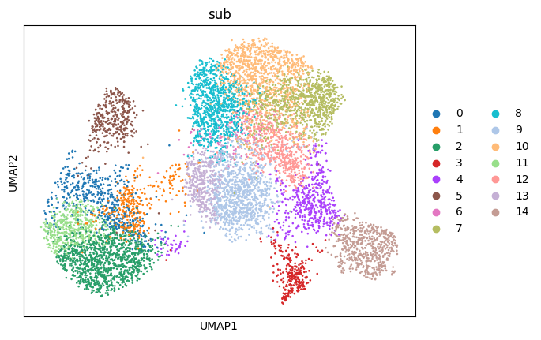
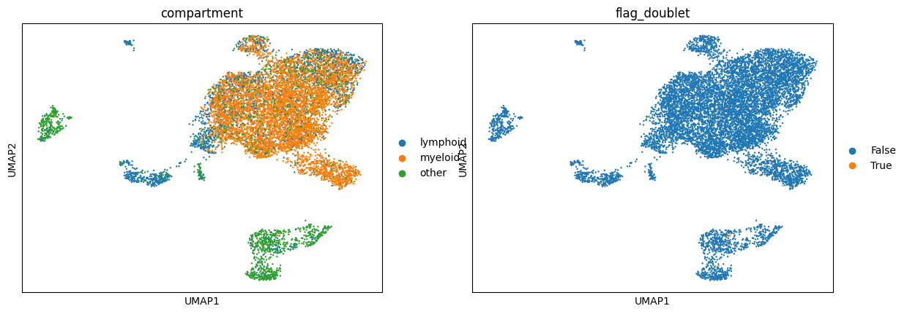

# EyeKB — 眼睛单细胞注释知识库与文献证据服务

**EyeKB 是面向眼球组织单细胞 RNA 测序（scRNA-seq）数据的注释辅助系统**，由两部分构成：

1. **细胞类型知识库**——人眼与小鼠视网膜的标志基因词典、组织细胞组成基线、疾病背景先验，每条知识都标注了文献来源（PMID）；
2. **文献检索服务**——约 24 万条眼科文献片段（3,800+ 篇论文）的本地检索引擎，可按细胞类型、组织、基因自由提问。

当你分析眼球单细胞数据、面对一个尚未命名的细胞群时，可以用它回答三个问题：这个群最可能是什么细胞？依据哪些标志基因？支撑判断的文献是哪几篇？

服务当前版本 `KB1v2-0.7-k9act`。由眼科研究组维护，用于课题组及合作者的单细胞注释质量控制。

**定位边界**：本系统是研究辅助工具，不是临床诊断工具，也不是黑盒分类器。每一条检索结果都带 PubMed 文献号，可逐条核查；所有注释结论须经研究者确认（human-in-the-loop）后方为有效。

## 输入与输出

### 输入

支持两种标准形态，任选其一：

- **`.h5ad`**（AnnData 对象，Scanpy 工作流产物；建议用 anndata ≥ 0.13 读写）
- **10X Genes 目录**（`matrix.mtx` + `barcodes.tsv` + `genes.tsv`；Ensembl ID 或 gene symbol 均可，自动映射）

对输入数据的要求：

1. **原始计数矩阵（raw counts）**。标准化、高变基因选择、降维、批次校正在流程内完成；若矩阵已做过 log1p/scale 处理，请在提交时说明。
2. **样本元数据需注明物种（human / mouse）与组织/取材部位**（视网膜、黄斑、玻璃体膜、眼表、泪腺等）。知识库按"物种 × 组织"分面管理，部位决定使用哪套组成基线，标注错误会导致对照失效。
3. **提供样本分组信息**（对照 / 疾病 / 治疗状态）。疾病背景先验的比对需要分组才能启用。
4. **不包含任何患者标识或临床隐私字段**。系统只消费表达矩阵与元数据，姓名、住院号等字段请在提交前移除。

无需提供已完成的注释结果；如你有预期的细胞类型清单，可作为参考一并提交比对。

### 输出

| 产物 | 内容 |
|---|---|
| **注释证据报告**（每个细胞群一份） | 该群的 marker 基因；候选细胞类型及知识库匹配得分；细胞比例相对文献基线（供者水平区间）的偏移；疾病背景先验的一致性检查结果；支撑文献片段及 PMID；置信度分级（证据一致 / 相近 / 冲突或混合群，需人工复核） |
| **注释定稿** | 研究者确认后写回的 `.h5ad` |
| **质控报告** | 线粒体比例、检出基因数、doublet 评分、批次校正前后对比、UMAP 可视化 |
| **审计记录** | 全部证据报告与人工决定存档，每个标签可回溯到当时的依据 |

## 标准分析流程

完整流程分三个阶段、九个步骤：

**阶段 A — 常规单细胞处理（标准工具链：Scanpy / Harmony / Scrublet）**

| 步骤 | 操作 | 说明 |
|---|---|---|
| 1 | 数据载入 | 读入矩阵与元数据，gene ID 统一映射，统计细胞数、基因数及分样本构成 |
| 2 | 质控过滤 | 剔除低质量液滴与死细胞（线粒体比例、检出基因数阈值），Scrublet 检测并过滤 doublet |
| 3 | 标准化与聚类 | log-normalization → 高变基因 → PCA；多样本数据先经 Harmony 批次校正（避免按样本假性分群），随后 UMAP + Leiden 聚类 |

**阶段 B — 知识库比对（EyeKB 核心功能，五个查询工具）**

| 步骤 | 操作 | 说明 | 查询工具 |
|---|---|---|---|
| 4 | marker 比对 | 对每个 cluster 的 top 基因查标志基因词典，得到候选细胞类型与匹配得分 | `query_marker` |
| 5 | 组成对照 | cluster 比例对照正常眼组织组成基线（按组织区域与建库方式分面的供者水平区间），超出区间的组合物种群发出提示标记 | `get_tissue_composition` |
| 6 | 疾病先验比对 | 按分组信息核对疾病 × 组织的背景先验，检查变化方向是否符合文献预期 | `get_disease_prior` |
| 7 | 文献查证 | 以每个群的表征基因为查询词检索本地文献库，返回原文片段、PMID、期刊与年份 | `search_literature` |
| — | （词条原文查阅） | 需要核对词典条目全文时读取知识库页面 | `get_kb_page` |

**阶段 C — 研究者确认**

| 步骤 | 操作 | 说明 |
|---|---|---|
| 8 | 逐群审查 | 证据一致的群可批量确认；存在冲突或混合迹象的群需逐一人工判定：接受、修改或标注"不确定" |
| 9 | 定稿与存档 | 确认后的标签写回数据对象；证据报告与人工决定一并归档，支持事后审计 |

**方法学纪律**：证据不足或无法分离的细胞群，输出"不确定"是合规结论，系统不会将存疑结果表述为确定结果。阶段 A 为行业通用流程；阶段 B 是本知识库的贡献；阶段 C 的最终判定权始终在研究者。

## 批量注释（pipeline/）

上面阶段 A+B 的七个步骤有一个可直接运行的入口：输入自己的数据（格式要求回链上文**《输入与输出》**一节：原始计数、注明物种与组织、样本可区分），逐簇产出五工具证据报告与待裁决清单。

```bash
python pipeline/run_pipeline.py --input data.h5ad --species human --tissue retina --group-col treatment --out results/run1        # h5ad 形态
python pipeline/run_pipeline.py --input 10x_dir/ --species human --tissue retina --sample-group "S1=control;S2=case" --out results/run2  # 10X 三件套（父目录=多样本）
python pipeline/run_pipeline.py --input data.h5ad --species human --tissue retina --ensg-map ids.tsv --out results/run3           # 输入只有 Ensembl ID 时
python pipeline/run_pipeline.py --input data.h5ad --out results/run4                                                                    # 物种/组织不填=自动预判（默认）
```

前置样本预判（S0 门，默认启用，**shadow 语义=判不过不阻断**）：任何输入先做物种 ×
组织自动判定（基因 ID 构成 / symbol 惯例与 marker 互打 / 组成打分三证据 + 六条硬门：
物种矛盾、组织分差不足、域外、深度不足、疑似胎儿期材料等）。弃权时 pipeline **继续运行**
（本批 Phase 1=shadow：S0 结论只是记录），输出 `REPORT_ABSTAIN.md`（人读记录件）与
`s0_gate_report.json`（三证据全读数）——"分不开就报审，不硬标"是方法学原则，阻断式硬门
留待 Phase 3（WIRE-2 另批验收）经 `EYEKB_S0_ENFORCE=1` 切换，届时判不过才停止执行。
显式传 `--species/--tissue` 视为人工覆盖，在报告记 `s0_overridden_by_user` 留痕。环境变量
`EYEKB_S0_GATE=0` 为整体回退开关（恢复纯人工参数旧行为，用于对照与应急）。
判定通过后，对应（物种 × 组织）坐标的 known-claims 结构化条目（`pipeline/pitfalls/`，
原子 claim 契约）会以**风险旗标**注入证据报告头段与待裁决清单两列
（`pitfall_risk_flags` / `pitfall_review_required`）——只提示复核方向，
**不自动改写任何分级/票面/具名**（自动具名变化恒=0，盲评前不注入条目自由文本，
含答案依赖的条目判读后才开放；见 `docs/PITFALLS_RAG_ISOLATION.md`）。

产出五件：处理后的 `.h5ad`（含批次校正与聚类标记）、质控图（线粒体比例、基因检出数、doublet、UMAP 前后）、`annotation_evidence_report.json/.md`（每簇 top 基因、marker 候选与得分、组成基线对照的越界旗标、疾病先验原文提及、文献片段+PMID、机械置信度分级）、`decisions_template.csv`（每簇一行，`decision` 列的 accept / modify / **abstain** 三值留空，由研究者填写——**弃权是合法输出，本入口不把存疑结果写成确定标签，也不含任何自动打分或自动命名逻辑**）、`s0_gate_report.json`（S0 样本预判三证据读数与留痕，回退态不产出）。默认路径**零 LLM**：五工具是本地机械检索；可选 `--llm-assist` 只调用用户自备通道（读环境变量，仓内不含任何真实 key/URL），且只附加参考叙述、不改变分级。详见 `pipeline/README.md`。

## 知识库的组织结构

| 层 | 位置 | 作用 |
|---|---|---|
| **词典层** | `kb/`（markers / composition / priors） | 步骤 4–6 的对照基准。每条断言附 PMID；按物种、组织、发育阶段（胎儿/成人分列）管理 |
| **文献层** | `literature_db/`（经 Releases 下载） | 步骤 7 的检索对象；同时是词典条目的出处——任何断言均可回溯到原文 |
| **操作规程层** | `docs/skills/` | 注释的标准作业程序（SOP）与验证规范：冻结评估集、双盲比对、弃权规则，约束步骤 4–9 的执行质量 |
| **项目记录层** | `docs/wiki/`、`docs/VERSION_NOTES.md` | 项目状态、历史决定与逐版本变更记录——面向维护者，不进入单次分析流程 |
| **批量入口层** | `pipeline/` | 步骤 1–7 的可执行入口（阶段 A 标准处理 + 阶段 B 逐簇证据采集），输出证据报告与待人工裁决清单；默认零 LLM |

## 长什么样

下面两张图是体系在真实数据上的产出示例（PDR 玻璃体膜单细胞数据集 GSE165784 的注释辅助流程：批次整合 → doublet 质控 → 髓系亚群细分；知识库词条参与判读，标签由研究者逐群确认后定稿）：





（两张图仅展示工作方式，不构成任何疗效或临床结论。生成脚本随图收录在 `docs/plans/figure_uplift_20260928/scripts/`。）

## 5 分钟跑通

需要 Python ≥ 3.11，普通 CPU 机器即可（不需要 GPU），约 4 GB 磁盘存放数据。

```bash
# 1) 克隆 + 装依赖
git clone https://github.com/DRYBW/SZ_OPHT_KB.git && cd SZ_OPHT_KB
python3 -m venv .venv && . .venv/bin/activate
pip install "sentence-transformers>=3" pyarrow pandas numpy mcp

# 2) 下载文献语料（在 Releases 页面，不进 git 仓库）
gh release download v2.4.2-rag-assets --pattern '*'
# 没装 gh CLI 的话，直接在浏览器打开 Releases 页手动下载这三个文件：
#   EYEKB_RAG_v2.4.2_slim.tar.part_aa / part_ab / .sha256
cat EYEKB_RAG_v2.4.2_slim.tar.part_* > EYEKB_RAG_v2.4.2_slim.tar
sha256sum -c EYEKB_RAG_v2.4.2_slim.tar.sha256   # 三件齐全且哈希正确才继续
tar -xf EYEKB_RAG_v2.4.2_slim.tar               # 解出 literature_db/v2.4.2_2026-09_slim/

# 3) 命令行问一次："Müller 胶质细胞在视网膜里有什么标志基因？"
python clients/ocularkb/rag/scripts/stage3_retrieve.py \
  --cell-type "Muller glia" --tissue retina --db-dir literature_db/v2.4.2_2026-09_slim
```

**第 3 步需要一个嵌入模型**（将自然语言查询转换为向量检索坐标的开源模型，BAAI bge-large-en-v1.5；本系统不训练模型，模型也不参与任何细胞注释判断）。三种获取方式，按推荐排序：

1. **本仓 Release 附件（推荐，免翻墙）**：首选单文件 `bge-large-en-v1.5_fp16.tar`（约 640 MiB，fp16 量化版，黄金 41 题与 fp32 逐位一致）；网络不佳可改用同 Release 的 4 分卷 `bge-fp16.part_aa..ad`。解包后仓库根目录即有 `models/bge-large-en-v1.5/`，检索引擎会自动找到它：
   ```bash
   # 首选单文件：
   gh release download model-bge-large-en-v1.5 -p 'bge-large-en-v1.5_fp16.tar*'
   sha256sum -c bge-large-en-v1.5_fp16.tar.sha256   # 应输出 OK（21d5fa2e… 与分卷拼接件同物）
   tar -xf bge-large-en-v1.5_fp16.tar
   # 单文件下载失败（大文件偶发断流）时改用分卷：
   gh release download model-bge-large-en-v1.5 -p 'bge-fp16*'
   cat bge-fp16.part_aa bge-fp16.part_ab bge-fp16.part_ac bge-fp16.part_ad > bge-fp16.tar
   sha256sum -c bge-fp16.tar.sha256   # 五条全过（拼接件 21d5fa2e… 与 4 分卷）才继续
   tar -xf bge-fp16.tar
   ```
   两种途径解出的目录内容逐字节相同（同一 tar 流）。
2. **从 HuggingFace 拉原版公开权重** `BAAI/bge-large-en-v1.5`，解到 `models/` 同名目录或用环境变量指路：
   ```bash
   export HF_ENDPOINT=https://hf-mirror.com   # 中国大陆网络建议先设镜像
   huggingface-cli download BAAI/bge-large-en-v1.5 --local-dir models/bge-large-en-v1.5
   ```
3. **不用模型**：检索自动降级为**词法匹配模式**并明确标注（结果带 `retrieval_mode: lexical_fallback`）。词典、组成基线、疾病先验、词条页四个工具本来就不依赖模型，不受影响。

也可用 `EYEKB_MODEL_DIR=/路径` 显式指定模型位置。能打出检索结果（无论哪种模式），就说明整套环境是通的。

## 接入你的 AI 工作流（MCP 服务）

本仓库自带一个标准 [MCP](https://modelcontextprotocol.io) 服务，可以接入 Claude Desktop、Cursor 等任何 MCP 客户端，让 AI 助手在帮你做细胞注释时**先查权威依据再下结论**：

```json
{
  "mcpServers": {
    "eyekb": {
      "command": "/path/to/.venv/bin/python",
      "args": ["/path/to/SZ_OPHT_KB/mcp_server/server.py"]
    }
  }
}
```

服务只走本地 stdio，不开任何网络端口。`search_literature` 的文献库位置按以下顺序自动解析：环境变量 `EYEKB_DB_DIR` → 指针文件 `kb/literature_db/EYEKB_DB_POINTER.yaml` 中 `role: default` 且实际存在的条目 → **本仓唯一一份已解包语料**（照上文第 2 步解包后无需任何配置即自动发现）；其余四个工具只读仓库自带的 `kb/`，clone 后开箱即用。

### 可以问它的 5 件事

| 工具 | 一句话说明 | 示例问法 |
|---|---|---|
| `search_literature` | 按细胞类型/组织检索文献片段，返回原文、PMID、期刊年份、与标志基因的共现 | "视网膜里的小胶质细胞，近十年文献怎么说的" |
| `query_marker` | 给一组基因，查它们指向什么细胞类型；或给细胞类型，查权威标志基因 | "CD68、P2RY12、TMEM119 共表达意味着什么" |
| `get_tissue_composition` | 正常眼组织里各细胞类型的应有比例基线（每行都挂文献号，供者水平统计） | "正常人视网膜的视杆/视锥比例大致多少" |
| `get_disease_prior` | 疾病 × 组织的背景知识层（细胞身份层级、状态轴、取材差异提示） | "PDR 的黄斑前膜样本和视网膜样本不能直接比" |
| `get_kb_page` | 读取知识库原文页面（索引/主题/组织三种页面） | "打开小胶质细胞词条" |

### 组成基线怎么用

`get_tissue_composition` 给出的是**参考区间而非判定标准**：如果你的数据集里某类细胞比例明显落在文献区间之外，系统会给出提示标记，供你回头检查——可能是取材差异、富集方案，也可能是注释错误。2026-09 起基线已按组织区域（视网膜/黄斑/眼表分别建基线）和建库策略（细胞悬液/单核悬液）细化，减少"用错基线对照错数据"的误报。

## 数据与知识规模

- **文献层**：默认库 = v2.4.2 冻结原件（约 24.3 万条片段 / 3,869 篇，含预印本标记列；2026-10-01 起默认库自 v2.0〔约 17.5 万条 / 2,713 篇，保留为 legacy 只读〕切换，切换依据=覆盖/回归/黄金三组门全过且与 G2/G3 复现语料同库，内外机默认态一致）。全部来自公开眼科与单细胞文献，每条可溯到 PMID。
- **词典层**（`kb/`，100+ 件）：人眼与小鼠视网膜的细胞类型标志基因词典、组织组成基线（v0 混合设计版 + v1 分层版）、疾病先验矩阵。
- **操作规程与验证记录**（`docs/`）：细胞注释标准作业程序、历次双盲验证的完整证据（任务定义、判定表、投票记录、脚本），共约 2,300 件，全部可复算。

## 如何验证你装出来的和我们的结果一致

```bash
pip install -r requirements.repro.txt   # 锁定版本环境
python tests/verify_repro.py --db-dir literature_db/v2.4.2_2026-09_slim
# 输出 REPRO PASS: 41/41 = 与全仓锚点同分布
```

这 41 道"回归题"是全项目的复现基准：检索排序须逐位对齐。**复现验收以官方 dense 模式为准**——请先按上文放好嵌入模型再跑（词法降级模式下结果不同，属预期，不算复现失败）。如果模型到位仍有一题对不上，按 `docs/VERIFY_CONTRACT.md` 的三层排查走，**不要修改判据来迁就结果**。

## 目录结构

```
mcp_server/          证据服务本体（server.py + 核心逻辑 + 留痕/软提示层）
clients/ocularkb/    检索引擎（stage3_retrieve.py 等）
kb/                  词典层：标志基因、组成基线、疾病先验（100+ 件）
rag_snapshots/       语料元数据快照
tests/               41 题复现基准
docs/wiki/           项目当前状态、历史决定（脱敏镜像）
docs/skills/         注释标准作业程序与验证规范
docs/plans/          历次验证与审计的完整证据链
docs/VERSION_NOTES.md  逐版本变更与对账记录（审计存档）
figures/             上文两张示例图
```

## 重要限制（请务必读）

1. **输出是待确认的建议，不是结论。** 所有注释建议必须经研究者确认后使用；本项目不做临床诊断。
2. **证据只能用于人工判读，禁止作为自动分类器的训练或评分信号。** 本服务的输出可用于辅助人工判断细胞身份，但禁止被任何自动分类/评分系统当作输入消费（项目红线，写入操作规程）。
3. **疾病先验只是背景参考。** `get_tissue_composition` / `get_disease_prior` 的区间是文献统计参考，公共疾病数据集（如 PDR 新生血管膜）本身的注释质量参差，不能当作达标线。
4. **大文件走 Releases。** RAG 语料各版本（约 940 MB–3 GB）都在 Releases 页面（带 sha256 校验），git 仓库本体保持轻量。
5. **h5ad 版本兼容性**：处理评估集请用 anndata ≥ 0.13（0.11.x 读新版矩阵格式会报错）。纯 MCP 服务不需要 anndata。

## 引用

本项目暂无正式论文。如在研究中使用了本知识库或其数据，建议引用：

```
EyeKB / SZ_OPHT_KB: an evidence-backed cell-type knowledge base and
literature retrieval service for ocular single-cell annotation.
GitHub repository, version 0.7 (2026). RAG corpus snapshot v2.4.2 (2026-09).
```

同时请引用你实际消费到的具体词条所附的原始文献（每条返回都带 PMID）。

## 维护与审计

- 逐版本变更说明、镜像对账表、收录/排除记录、脱敏说明等内部审计信息：见 [`docs/VERSION_NOTES.md`](docs/VERSION_NOTES.md)。
- 同步与复现契约：`docs/VERIFY_CONTRACT.md`、`docs/RAG_REBUILD.md`。
